# Триггер

**Триггер** — базовый запоминающий элемент цифровой схемотехники, способный находиться в одном из двух устойчивых состояний и сохранять это состояние неограниченно долго.

## Что такое триггер

Простейший запоминающий элемент можно представить как два инвертора, объединенных в замкнутую систему:

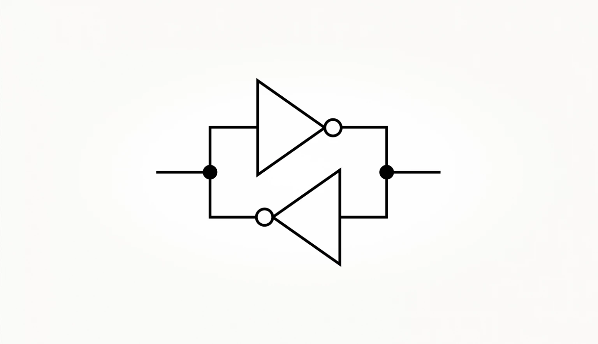


Такое устройство называется триггером.

Допустим, в одном узле схемы при включении у нас логический ноль — тогда в другом будет логическая единица. И через инвертор она поддержит логический ноль в первом узле.

### Неопределенность при запуске
Что если при включении питания напряжение в обоих узлах одинаковое? Один инвертор может быть мощнее другого буквально на доли процента — частая история. Этого достаточно, чтобы он одержал верх над своим «братом» и заставил переключаться в противоположное состояние. 
# RS-триггер
1. RS-триггер — простейший запоминающий элемент цифровой схемотехники.  
Хранит 1 бит информации (0 или 1) неограниченно долго, пока есть питание.

2. Принцип работы
Состоит из двух логических элементов **2И-НЕ**, соединенных перекрестно:
- Выход первого → вход второго
- Выход второго → вход первого

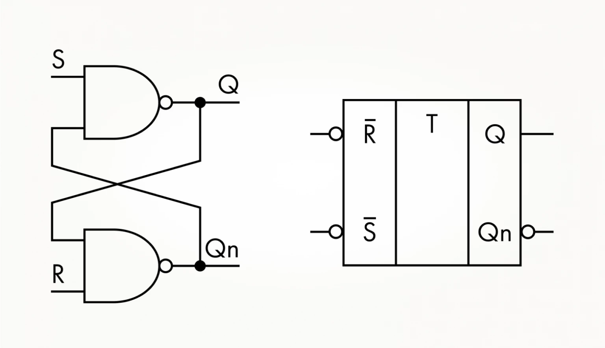

 3. Обозначения
- **S** (Set) — вход установки (устанавливает Q = 1)
- **R** (Reset) — вход сброса (устанавливает Q = 0)
- **Q** — прямой выход
- **¬Q** (Qn) — инверсный выход (всегда противоположен Q)
- Кружочки на входах означают: **активный уровень — 0** (триггер реагирует на ноль)

4. Таблица истинности


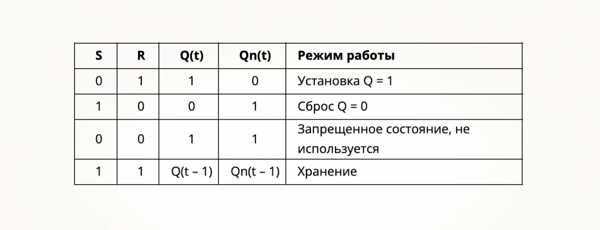

5. Режимы работы

Set (S=0, R=1)
- Ноль на S заставляет верхний вентиль выдать 1 на Q
- Q=1 поступает на нижний вентиль, получаем Qn=0

Reset (S=1, R=0)
- Ноль на R заставляет нижний вентиль выдать 1 на Qn
- Qn=1 поступает на верхний вентиль, получаем Q=0

Хранение (S=1, R=1)
- Схема "помнит" последнее состояние
- Если было Q=1, то остается 1; если было Q=0, остается 0

Запрещенное состояние (S=0, R=0)
- Оба выхода становятся равны 1
- Нарушается логика работы (выходы должны быть противоположны)
6. Временная диаграмма работы:
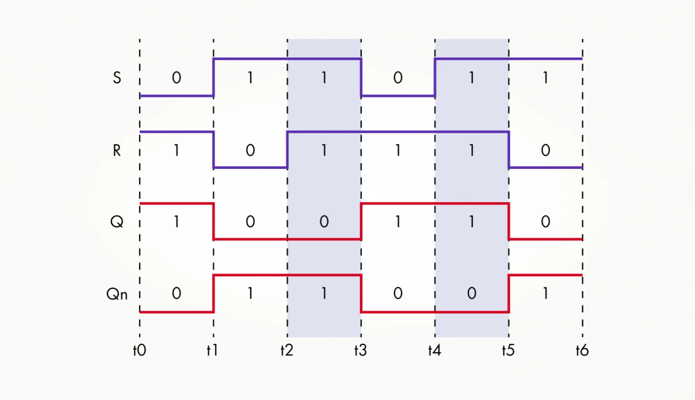
7. Реализация на SystemVerilog:

Модуль RS-триггера (`rs_trigger.sv`)

```systemverilog
module rs_trigger (
    input  logic S,    // Set (активный 0)
    input  logic R,    // Reset (активный 0)
    output logic Q,    // Прямой выход
    output logic Qn    // Инверсный выход
);
    
    // Перекрестные связи двух элементов И-НЕ
    assign Q  = ~(S & Qn);  // Верхний вентиль
    assign Qn = ~(R & Q);   // Нижний вентиль
    
endmodule
```
# D-триггер
1. *Delay*  — это синхронный запоминающий элемент, который задерживает входной сигнал до очередного тактового импульса. По сути, это синхронный RS-триггер, у которого вход S соединен со входом D напрямую, а вход R — через инвертор.

2. Функции
D-триггер устраняет главную проблему RS-триггера — **запрещенное состояние**. Благодаря инвертору между S и R, входы всегда противоположны, поэтому комбинация S=0, R=0 (или S=1, R=1) просто невозможна.

3. Принцип устройства
Состоит из синхронного RS-триггера, у которого:
- Вход **S** соединен напрямую со входом **D**
- Вход **R** соединен со входом **D** через **инвертор**

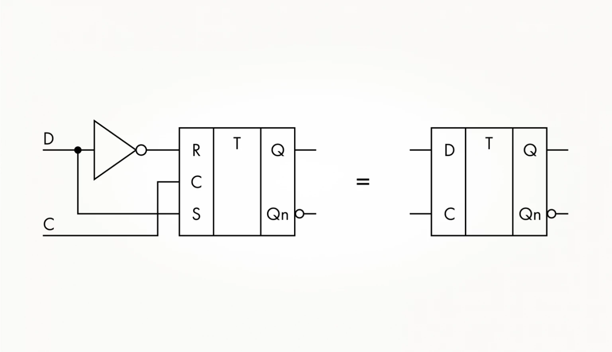

4. Обозначения
- **D** (Data) — вход данных
- **C** (Clock) — тактовый вход (синхросигнал)
- **Q** — прямой выход
- **¬Q** (Qn) — инверсный выход

5. Таблица истинности
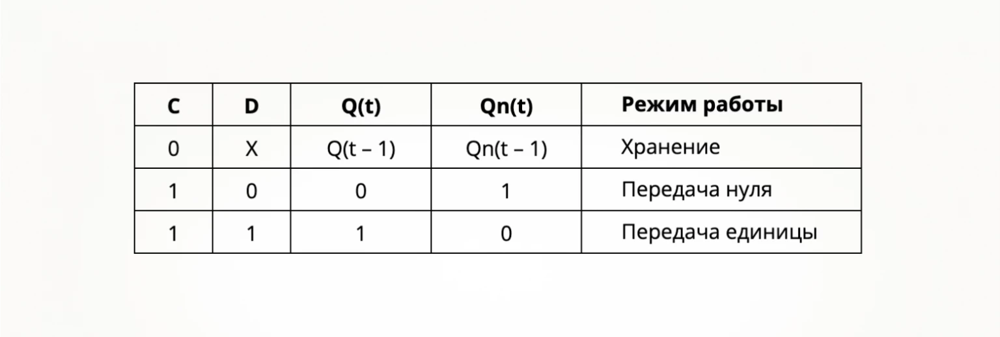

## 6. Как работает
1. **Когда C = 0** — триггер игнорирует вход D и хранит предыдущее состояние
2. **Когда C = 1** — триггер пропускает вход D на выход Q:
   - Если D = 0 → Q = 0
   - Если D = 1 → Q = 1

## 7. Временная диаграмма

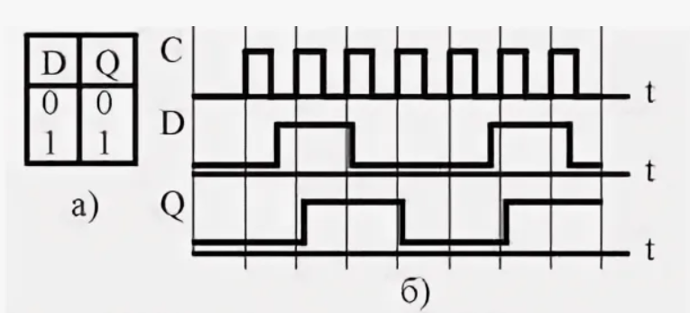


## 8. Реализация на SystemVerilog

### Модуль D-триггера (`d_trigger.sv`)

```systemverilog
module d_trigger (
    input  logic clk,  // Тактовый сигнал
    input  logic d,    // Вход данных
    output logic q,    // Прямой выход
    output logic qn    // Инверсный выход
);
    
    always_ff @(posedge clk) begin
        q  <= d;
        qn <= ~d;
    end
    
endmodule
```
# Двухступенчатый (Master-Slave) триггер

## Проблема обычных триггеров
Они "прозрачны" — пока C=1, входные сигналы сразу проходят на выход. Нужно держать входы стабильными всё это время.

## Решение — два триггера (Master + Slave)
Берем два RS-триггера и соединяем:
- **Master** — первый, принимает входные сигналы
- **Slave** — второй, его выходы = общие выходы схемы
- Тактовый сигнал на Slave подаем через инвертор

## Как работает
| C | Master | Slave | Выходы Q |
|---|--------|-------|----------|
| 1 | Прозрачный (принимает входы) | Заблокирован (хранит) | Не меняются |
| 0 | Заблокирован (хранит) | Прозрачный (принимает от Master) | **Обновляются** |

## Главное
- Выходы меняются **только в момент среза C** (переход 1→0)
- Входные сигналы могут прыгать как угодно при C=1 — на выход попадет только то, что было **перед самым срезом**
- Помехи и дребезг игнорируются
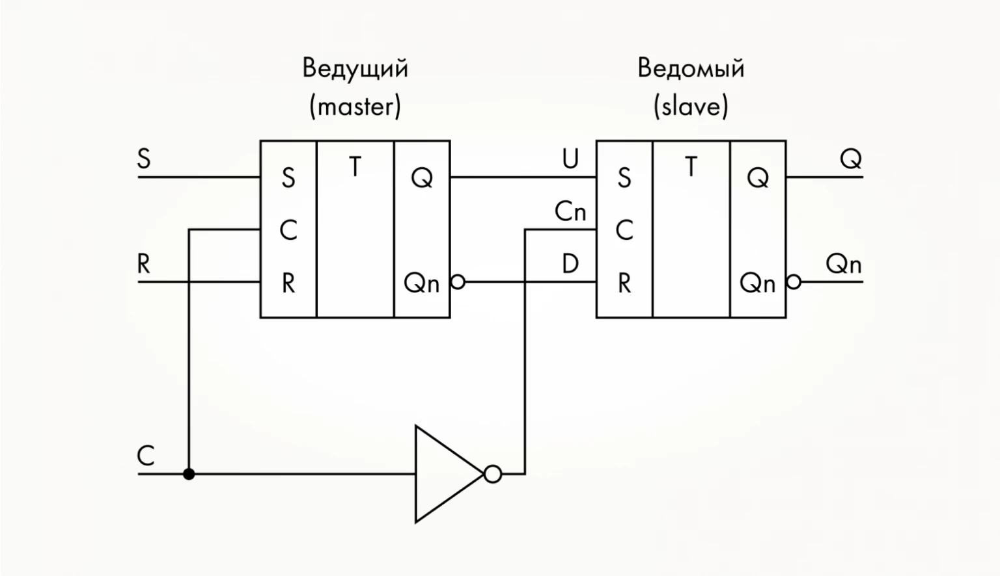
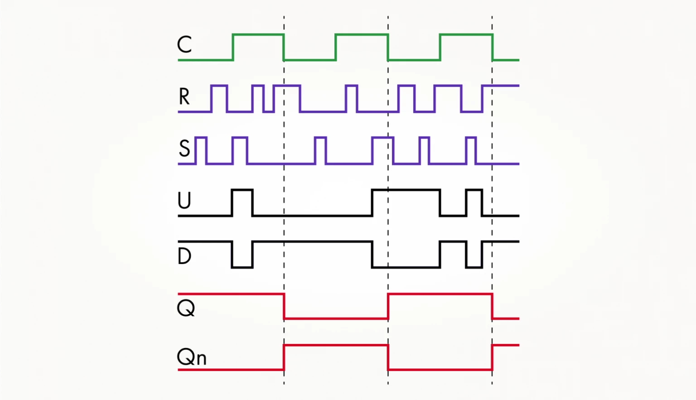

# Чем триггера отличаетться от Latch:
**Latch (защелка)** управляется **уровнем** сигнала, а **Flip-Flop (триггер)** — **фронтом**.
## D-Latch (Защелка)
**Управление:** Уровень сигнала Enable (EN)

**Принцип работы:**
- Пока `EN = 1` — защелка **прозрачна**: выход Q повторяет вход D
- Любое изменение на входе D **мгновенно** проходит на выход
- Когда `EN = 0` — защелка **закрыта**: выход хранит последнее значение

## D-Flip-Flop

**Управление:** Фронт сигнала Clock (CLK)

**Принцип работы:**
- Срабатывает **только в момент перепада** CLK (0→1 или 1→0)
- Делает "снимок" входа D по фронту и запоминает его
- Между фронтами выход **не меняется**, игнорируя любые изменения на входе
- 
## Примеры на Verilog

### Кронкретно в коде 
```verilog
always_ff @(posedge clk) begin #триггер
    q <= d;

always_latch begin # защелка
    if (en) begin
        q <= d;
```
### Защелка
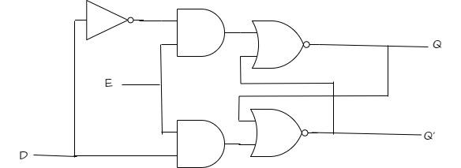
### Cравнительная временная диаграмма
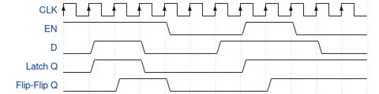


```
# Пример реализации
module d_latch(
    input logic en,  // Enable (управление)
    input logic d,   // Вход данных
    output logic q   // Выход
);
    
    always_latch begin
        if (en) begin
            q <= d;  // Когда en=1: q повторяет d (прозрачность)
        end
        // Когда en=0: q хранит последнее значение
    end
    
endmodule
