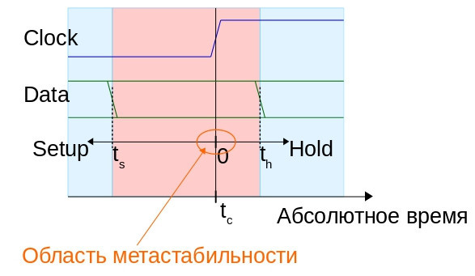
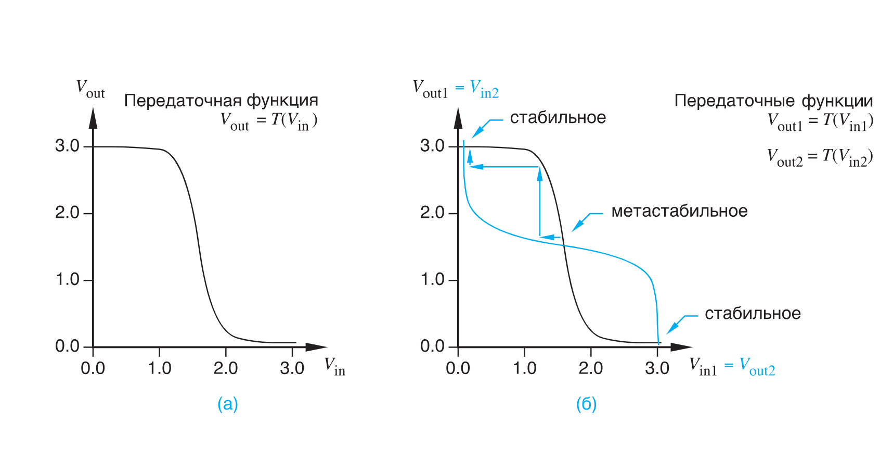
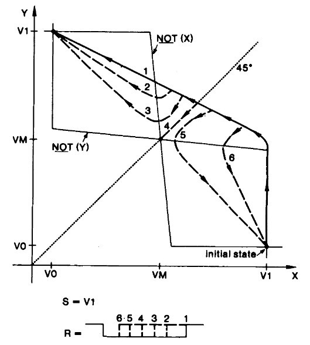
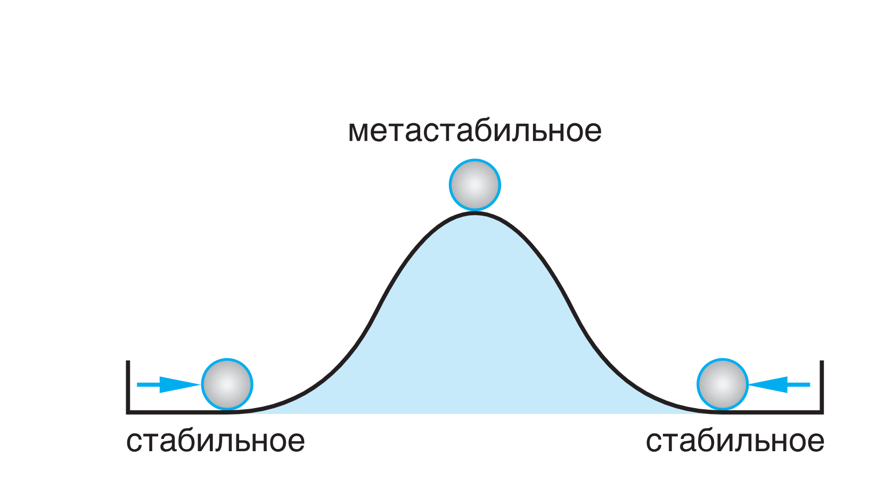
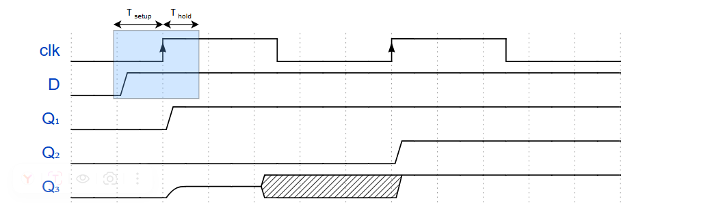
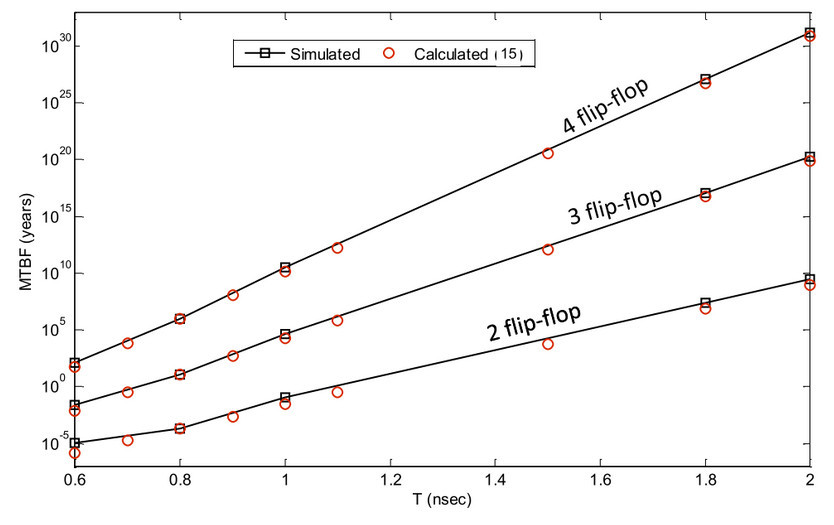
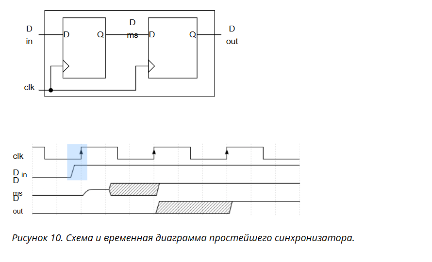

# Метастабильность в цифровых схемах:

## 1. Введение

Метастабильность – это явление, при котором выход триггера (или защелки) оказывается в неустойчивом промежуточном состоянии, не соответствующем ни логическому «0», ни логической «1». Это состояние возникает, когда изменение входного сигнала происходит слишком близко к моменту тактирования, нарушая требования по временам предустановки (setup) и удержания (hold). В полностью синхронных системах (один тактовый сигнал или кратные частоты от одного источника) эти требования легко выполняются, и метастабильность не проявляется. Однако при передаче данных между разными тактовыми доменами (Clock Domain Crossing, CDC) сигналы приходят асинхронно, и гарантировать соблюдение setup/hold невозможно. Это приводит к редким, но потенциально опасным сбоям.

Проблема осложняется тем, что компиляторы и симуляторы не выявляют такие ошибки: проект может идеально работать в моделировании, но давать сбои при аппаратной реализации. Понимание физической природы метастабильности и методов борьбы с ней необходимо каждому разработчику цифровых устройств.

## 2. Временные параметры триггера: Setup и Hold

**Setup time $t_{su}$** – минимальное время, на которое сигнал данных должен установиться (стать стабильным) **до** прихода активного фронта тактового сигнала.

**Hold time $t_h$** – минимальное время, в течение которого сигнал данных должен оставаться стабильным **после** прихода активного фронта тактового сигнала.

Интервал $[t_{su}, t_h]$ относительно фронта называется **апертурным окном** (окном неопределённости). Если изменение данных происходит строго за пределами этого окна, триггер работает детерминированно. Если изменение попадает внутрь окна, триггер может войти в метастабильное состояние, причём вероятность этого тем выше, чем ближе момент изменения к центру окна.

  
*Описание:* На временной диаграмме показаны оси setup (влево) и hold (вправо) от фронта тактового сигнала; красная область – окно неопределённости; оранжевая – узкая область метастабильности.

---

## 3. Физическая природа метастабильности

### 3.1. Бистабильная ячейка (RS-защелка)

D-триггер построен на двух последовательных защелках (master-slave). Каждая защелка – это два инвертора, включённых перекрёстно (RS-защелка). Обозначим напряжения на выходах инверторов как $X$ и $Y$. В устойчивом состоянии $X$ и $Y$ всегда противоположны: $(X,Y) = (V_{DD},0)$ (логическая «1») или $(0,V_{DD})$ (логический «0»).

    
*Описание:* (а) передаточная функция одиночного КМОП-инвертора $V_{out}=T(V_{in})$; (б) наложение двух таких характеристик для инверторов, включённых в петлю. Точки пересечения – три точки равновесия: две стабильные (крайние) и одна метастабильная (центральная).

### 3.2. Математическая модель

Вблизи точки метастабильности $X \approx Y \approx V_{DD}/2$ передаточные характеристики инверторов линеаризуются. Пусть $\Delta = X - Y$ – разность выходных напряжений. Динамика системы описывается дифференциальным уравнением:

$
\frac{d\Delta}{dt} = \frac{\Delta}{\tau},
$

где ${\tau}$ = $C_{out}$ / $g_m$ – постоянная времени, определяемая паразитной ёмкостью в узлах $C_{out}$ и крутизной транзисторов $g_m$. Для современных технологий (65 нм и тоньше) $\tau$ составляет единицы–десятки пикосекунд.

**Решение:**  
$
\Delta(t) = \Delta_0 \cdot e^{t/\tau},
$
где $\Delta_0$ – начальное рассогласование в момент окончания управляющего импульса.

Время достижения логического уровня ($|\Delta| = V_{DD}$):

$
t_r = \tau \cdot \ln\left(\frac{V_{DD}}{|\Delta_0|}\right).
$

Если $\Delta_0$ очень мало (например, порядка теплового шума $\sqrt{kT/C}$), время $t_r$ может значительно превышать период тактовой частоты. При $\Delta_0 = 0$ время разрешения стремится к бесконечности – это идеальная метастабильность.

  
*Описание:* На рисунке обозначены две оси – напряжение на X и Y выходах RS-защелки. Отметки V0 и V1 – напряжение лог. 1 и лог. 0 выходов триггера, а Vm – напряжение, равное ½ Uпитания. На рисунке так же показано, что начальное состояние (Initial state) находится в точке плоскости {X=V1, Y=V0} — выходы триггера {X, Y} приняли логические значения {1,0}. На вход защелки S (Set) подан высокий потенциал (пассивное значение), а на вход R (Reset) подается импульс с активным нулем разной длительности (6-самый короткий, 1-самый длинный – изображено внизу рисунка). В соответствии с номером импульса на входе R, на рисунке показаны 6 траекторий переключения потенциалов пары выходов {Y,X}: для импульсов 1-3 происходит полное переключение триггера, для импульсов 5-6 триггер не переключится, а траектория 4 приводит триггер в центр зоны метастабильности (точка {Vm,Vm}), находящийся посередине между порогами лог. 1 и лог. 0.

### 3.3. Механическая аналогия

!
*Описание:* Шарик на вершине холма – метастабильное состояние; малейшее возмущение заставляет его скатиться в одну из двух устойчивых ложбин. Это иллюстрирует непредсказуемость конечного состояния и времени выхода из метастабильности.

## 4. Причины возникновения метастабильности

1. **Асинхронные внешние события** – сигналы от кнопок, переключателей, внешних интерфейсов (UART, USB и др.), не синхронизированные с тактовой частотой устройства.
2. **Несколько тактовых доменов** – модули внутри одной микросхемы работают от независимых тактовых сигналов (разные генераторы, PLL).
3. **Нарушение временных параметров** – из-за слишком длинных путей распространения сигнала (превышение максимальной рабочей частоты) или слишком коротких путей (нарушение hold).
4. **Асинхронный сброс** – если сигнал сброса не синхронизирован с тактовым сигналом.

 
*Описание:* Временная диаграмма, показывающая три исхода нарушения: Q1 принимает новое значение, Q2 – старое, Q3 входит в метастабильность и затем неопределённо разрешается.

---

## 5. Статический временной анализ (STA) и критический путь

Для синхронных схем основное условие работы: все переходные процессы должны завершиться за один такт. Критический путь – это комбинационная цепь с максимальной задержкой. Условие для выполнения setup:

$
T_{c2q} + T_{comb}^{max} + T_{setup} \le T_{clk} + T_{skew},
$

где $T_{c2q}$ – задержка от такта до выхода триггера, $T_{comb}^{max}$ – максимальная задержка комбинационной логики, $T_{skew}$ – перекос тактового дерева.

Условие для выполнения hold:

$
T_{c2q} + T_{comb}^{min} \ge T_{hold} + T_{skew}.
$

Нарушение setup устраняется уменьшением задержек или увеличением периода такта; нарушение hold – добавлением буферов для увеличения минимальной задержки.

## 6. Вероятностная оценка сбоев: MTBF

Среднее время между отказами (Mean Time Between Failures) для одного триггера:

$
MTBF = \frac{e^{\,T_{clk} / \tau}}{f_d \cdot f_{clk} \cdot W},
$

где $f_{clk}$ – частота тактирования приёмного домена, \(f_d\) – частота изменения данных, $T_{clk} = 1/f_{clk}$, $\tau\$ – постоянная времени триггера, $W$ – ширина апертурного окна (порядка $t_{su}+t_h$).

Для цепочки из $N$ последовательных триггеров (синхронизатора):

$
MTBF_N \approx \frac{e^{\,N \cdot T_{clk} / \tau}}{f_d \cdot f_{clk} \cdot W}.
$

Экспоненциальная зависимость означает, что добавление одного дополнительного триггера или небольшое увеличение периода такта радикально повышает надёжность.

*Описание:* График, где по вертикали – MTBF в годах, по горизонтали – период тактового сигнала передатчика. Показано, как MTBF растёт с добавлением триггеров.

## 7. Методы борьбы с метастабильностью

Простейший и наиболее распространённый способ – включить последовательно два триггера, тактируемых одним и тем же тактовым сигналом приёмного домена. Первый триггер может войти в метастабильность, но за период такта она с высокой вероятностью разрешится, и второй триггер захватит стабильный сигнал.

*Описание:* Показана схема из двух триггеров и временная диаграмма, иллюстрирующая, как асинхронный вход Din синхронизируется с тактовым сигналом clk, при этом выход Q имеет неопределённость в один такт.

---
