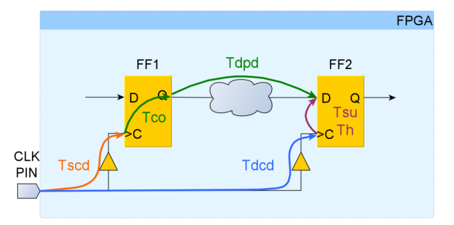
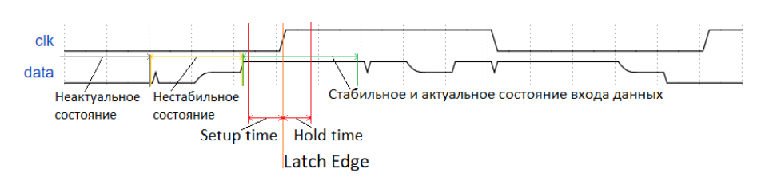
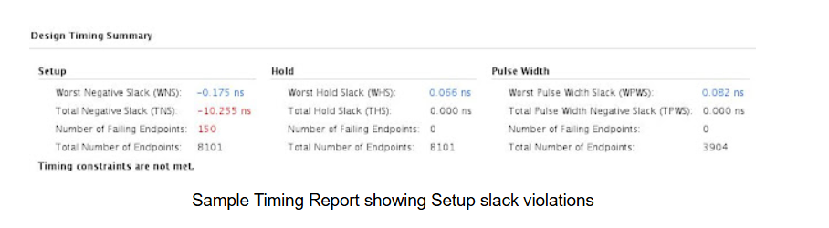

# Причины и устранение нарушений Setup и Hold в ПЛИС

## 1. Введение в проблему временны́х нарушений

Разработка цифровых устройств на ПЛИС подразумевает не только описание логики работы схемы, но и обеспечение её надёжного функционирования на заданной тактовой частоте. Нарушение временны́х ограничений (timing violations) является одной из основных причин некорректной работы проекта, проявляющейся в искажении данных, сбоях интерфейсов и непредсказуемом поведении.

Статический временной анализ (Static Timing Analysis, STA) — это метод проверки временны́х характеристик схемы без необходимости функционального моделирования. Цель STA — убедиться, что для всех путей передачи данных между последовательными элементами (триггерами) выполняются два ключевых условия: ограничение на максимальную задержку (Setup) и ограничение на минимальную задержку (Hold).
---

## 2. Фундаментальные понятия временного анализа

### 2.1. Путь передачи данных
Базовая модель передачи данных в синхронной схеме состоит из двух триггеров и комбинационной логики между ними:
- **Триггер-источник (Source Flip-Flop)** — FF1, запускает данные по фронту тактового сигнала.
- **Триггер-приёмник (Destination Flip-Flop)** — FF2, захватывает данные по следующему фронту тактового сигнала.
- **Комбинационная логика** — набор LUT, мультиплексоров, цепочек переноса и соединений (nets).

 
> *Схема пути данных между двумя триггерами с указанием задержек Tclk_source, Tco, Tdata_path, Tclk_dest.*

### 2.2. Setup Time и Hold Time
Для корректного захвата данных триггером-приёмником необходимо, чтобы сигнал на его входе D оставался стабильным в течение двух защитных интервалов:

| Параметр | Определение | Влияние на проектирование |
| :--- | :--- | :--- |
| **Setup Time (Tsu)** | Минимальное время **до** фронта тактового сигнала, в течение которого данные должны быть стабильны. | Определяет максимальную допустимую задержку данных. |
| **Hold Time (Th)** | Минимальное время **после** фронта тактового сигнала, в течение которого данные должны оставаться неизменными. | Определяет минимальную необходимую задержку данных. |

Данные величины являются паспортными характеристиками микросхемы и не могут быть изменены разработчиком. Для современных FPGA семейства Artix-7/UltraScale+ значения Tsu и Th составляют десятки пикосекунд.

 
>  *Временная диаграмма, показывающая защитный интервал Setup-Hold вокруг фронта тактового сигнала.*

### 2.3. Slack как мера запаса по времени
**Slack** — это разница между требуемым временем прибытия данных (Data Required Time) и фактическим временем прибытия данных (Data Arrival Time).

- **Slack > 0** — запас по времени достаточен, нарушений нет.
- **Slack = 0** — граничное состояние, схема работает на пределе возможностей.
- **Slack < 0** — нарушение временного ограничения, данные не будут корректно захвачены.

---

## 3. Анализ ограничения Setup (максимальная задержка)

### 3.1. Физический смысл
Проверка Setup гарантирует, что данные, отправленные триггером FF1 по фронту *N*, успеют дойти до триггера FF2 и установиться на его входе **до** прихода захватывающего фронта *N+1*.

### 3.2. Уравнение Setup Slack
Setup Slack = T_period - (Tco_max + T_data_max + Tsu) + T_skew
где:
- **T_period** — период тактового сигнала;
- **Tco_max** — максимальная задержка от фронта клока на входе FF1 до появления данных на выходе Q;
- **T_data_max** — максимальная задержка прохождения комбинационной логики и соединений;
- **Tsu** — время предустановки триггера FF2;
- **T_skew** — разница задержек тактового сигнала до FF2 и FF1 (`Tclk_dest - Tclk_source`).

> **Важно:** Положительный Skew (клок на FF2 приходит позже, чем на FF1) увеличивает Setup Slack, давая дополнительное время на распространение данных.

### 3.3. Причины нарушения Setup (Slack < 0)
Нарушение Setup возникает, когда фактическая задержка данных превышает доступное время (период тактовой частоты). Основные факторы:

1.  **Высокая логическая глубина (Logic Levels).** Большое количество последовательных LUT или элементов переноса (CARRY) в комбинационной цепи.
2.  **Чрезмерная тактовая частота.** Слишком малое значение `T_period`, не соответствующее возможностям кристалла и архитектуры схемы.
3.  **Отрицательный Clock Skew.** Тактовый сигнал приходит на FF2 раньше, чем на FF1, уменьшая доступное окно для передачи.
4.  **Высокая нагрузка (Fanout).** Один регистр управляет сотнями потребителей, что приводит к значительному росту задержки на проводах (Net Delay).
5.  **Неоптимальное размещение.** Физически далёкое расположение FF1 и FF2 после этапа Place & Route.

---

## 4. Анализ ограничения Hold (минимальная задержка)

### 4.1. Физический смысл
Проверка Hold гарантирует, что **новые** данные, отправленные триггером FF1 по фронту *N+1*, не придут на вход FF2 слишком быстро и не сотрут **старые** данные, которые FF2 ещё должен захватить по этому же фронту *N+1*.

### 4.2. Уравнение Hold Slack
Hold Slack = (Tco_min + T_data_min) - (Th + T_skew)

где:
- **Tco_min** — минимальная задержка выдачи данных триггером;
- **T_data_min** — минимальная задержка прохождения логики;
- **Th** — время удержания триггера FF2.

> **Важно:** В отличие от Setup, период тактового сигнала **не входит** в уравнение. Следовательно, снижение рабочей частоты не устраняет нарушения Hold.

### 4.3. Причины нарушения Hold (Slack < 0)
Нарушение Hold возникает, когда новые данные приходят на регистр-приёмник раньше, чем истекает требуемое время удержания предыдущих данных. Основные факторы:

1.  **Слишком короткий путь данных.** Отсутствие комбинационной логики (прямой провод) или минимальное количество LUT.
2.  **Большой положительный Clock Skew.** Тактовый сигнал на FF2 сильно задержан относительно FF1. FF2 захватывает данные с опозданием, а FF1 уже выдал новые.
3.  **Рукотворные тактовые сигналы (Gated Clocks).** Использование логических элементов для генерации вторичных клоков вне выделенных тактовых сетей.

---

## 5. Практические методы устранения нарушений

### 5.1. Устранение нарушений Setup

| Причина | Метод устранения | Комментарий |
| :--- | :--- | :--- |
| **Много уровней логики** | **Конвейеризация (Pipelining).** Разбить длинную комбинационную цепочку вставкой промежуточных регистров. | Увеличивает латентность на N тактов, но позволяет радикально поднять Fmax. |
| **Большой Fanout** | **Логическое копирование (Replication).** Создание нескольких копий управляющего регистра для распределения нагрузки. | Использовать атрибут `(* MAX_FANOUT = 50 *)` или `(* EQUIVALENT_REGISTER_REMOVAL = "NO" *)`. |
| **Неоптимальная упаковка** | **Явное указание ресурсов.** Применение атрибутов `(* USE_DSP = "YES" *)` или описание примитивов (Carry Chain). | Предотвращает реализацию сумматоров/умножителей на медленных LUT. |
| **Далекое размещение** | **Pblocks.** Локализация связанных модулей в определенной области кристалла. | Критически важно для больших заполненных проектов (>80% утилизации). |

### 5.2. Устранение нарушений Hold

| Причина | Метод устранения | Комментарий |
| :--- | :--- | :--- |
| **Короткий путь данных** | **Вставка задержки.** Использование опции `opt_design -hold_fix` или ручная вставка LUT, настроенного как буфер. | САПР автоматически добавляет буферы в пути с отрицательным Hold при включении этой опции. |
| **Большой Clock Skew** | **Выравнивание тактового дерева.** Использование общих локальных буферов (BUFR/BUFH) вместо глобальных (BUFG) для локальных модулей. | Требуется анализ дерева тактирования. |
| **Делители частоты на логике** | **Использование Clock Enable (CE).** Запрет на подачу сигналов с логики на тактовые входы триггеров. | Фундаментальное правило проектирования: тактовый сигнал должен поступать только от выделенных сетей. |

### 5.3. Критическая ошибка: «Рукотворные» клоки (Gated Clock)
**Описание:** Формирование тактового сигнала для группы триггеров с помощью счётчика-делителя или логического элемента (например, `assign clk_div = counter[24]`).

**Последствия:**
- Сигнал `clk_div` распространяется по линиям данных (не Clock Tree), что приводит к гигантскому непредсказуемому Skew.
- Нарушения Setup и Hold становятся неизбежными и не поддаются анализу стандартными средствами.

**Корректное решение:** Использовать единый высокочастотный клок и сигнал разрешения (CE) для включения/выключения регистров. Генерация новых частот должна производиться исключительно аппаратными модулями PLL или MMCM.

---

## 6. Анализ отчёта Timing Report в Vivado

Для диагностики нарушений используется детальный отчет **Path Report**, вызываемый из Timing Summary.

 
> *Скриншот окна Vivado Path Report с выделенными столбцами Incr, Path, Net Delay, Logic Delay и Clock Skew.*

**Алгоритм анализа пути:**
1.  **Определить тип нарушения** (Setup/Hold) и его величину (Slack).
2.  **Оценить соотношение Logic Delay и Net Delay:**
    - Преобладает **Logic Delay** (ячейки LUT, CARRY) — проблема в сложности RTL кода.
    - Преобладает **Net Delay** (соединения) — проблема в топологии размещения или Fanout.
3.  **Проверить Clock Path Skew.** Аномально высокие значения (сотни пикосекунд) указывают на проблемы с тактовым деревом.
4.  **Проверить Clock Uncertainty.** Убедиться в корректности задания джиттера (`set_input_jitter`).

---

## 7. Основные команды и атрибуты для управления STA в Vivado

| Команда / Атрибут | Назначение |
| :--- | :--- |
| `create_clock -period <value> [get_ports <name>]` | Задание периода основного тактового сигнала. |
| `set_clock_groups -asynchronous ...` | Исключение из анализа путей между асинхронными доменами (CDC). |
| `set_multicycle_path -setup 2 ...` | Указание, что путь данных требует 2 такта для завершения Setup. |
| `opt_design -hold_fix` | Автоматическая вставка задержек для устранения нарушений Hold. |
| `(* MAX_FANOUT = 50 *)` | Ограничение нагрузки на выход регистра (синтезатор сделает копии). |
| `(* IOB = "TRUE" *)` | Принудительное размещение выходного регистра в блоке ввода-вывода. |

---

## 8. Заключение: алгоритм действий при обнаружении нарушения

1.  Идентифицировать характер нарушения: **Setup** (зависит от частоты) или **Hold** (не зависит от частоты).
2.  Изучить **Path Report** для худшего пути.
3.  **Если Setup:**
    - Высокий Logic Level -> Конвейеризация кода.
    - Высокий Fanout -> Копирование регистров.
    - Длинные Net Delay -> Применение Pblocks.
4.  **Если Hold:**
    - Путь без логики -> Применить `opt_design -hold_fix`.
    - Большой Skew -> Анализ дерева тактирования, устранение "рукотворных" клоков.
5.  Проверить корректность файла ограничений (`.xdc`) на наличие ложных путей и исключений CDC.